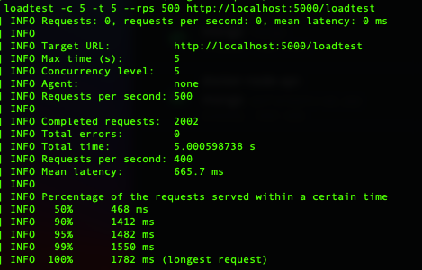

PerfAnalytics.API is a restful API which saves data, posted from PerfAnalytics.JS and returns time specific filtered data.

- This API
    - handles min 200 RPS, (this load test was done by "[laodtest](https://perf-analytics-dashbaoard.herokuapp.com/)".) 
    - calculates dashboard metrics < 1 second,
    - return data between specific dates or only last 30 minutes,
    - well designed for future implementations,
    - well tested,
    - properly designed for REST standards,
    - connects to MongoDB

- This application has been dockerized. Tests run before each push.
- The screenshot of Load Test is below

## Available Scripts

In the project directory, you can run:

### `docker-compose up -d`

Runs the MongoDB and API together. 
[http://localhost:5000](http://localhost:5000) to view it in the browser.
